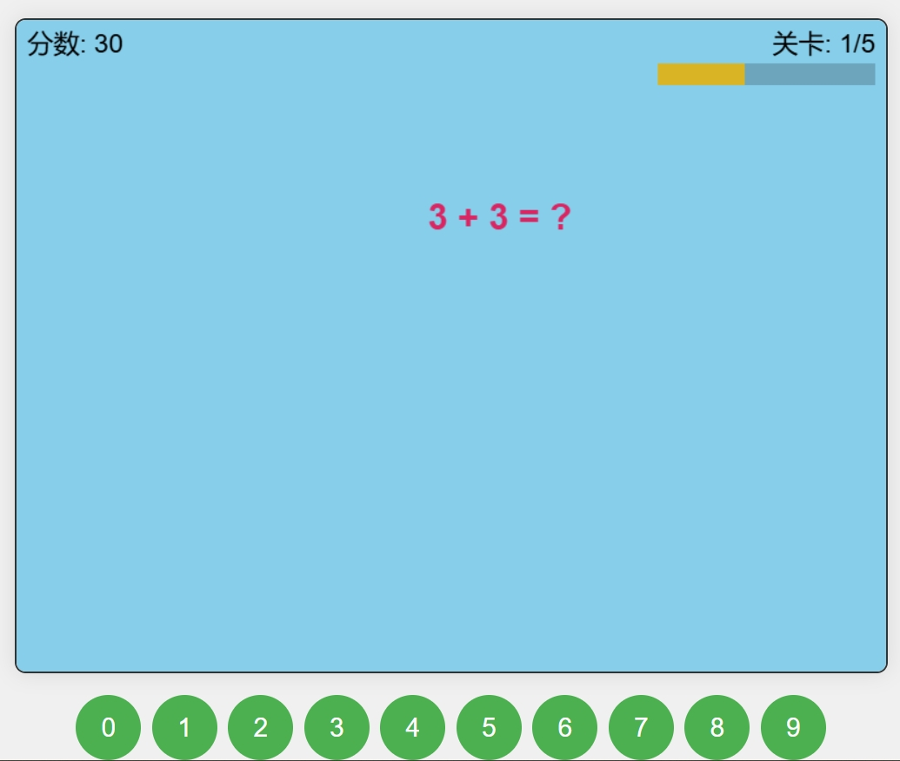

# Number Game

一个简单有趣的数字游戏，使用 HTML5 + JavaScript 开发。玩家需要在规定时间内找出所有匹配的数字对。适合给小朋友玩。

## ✨ 特性

- 🎯 多个难度级别
- ⏱️ 计时挑战模式
- 🏆 分数记录系统
- 🎵 音效反馈
- 📱 响应式设计，支持移动设备
- 🌈 精美的动画效果

## 🚀 快速开始

### 在线试玩

访问 [游戏演示页面](#) 即可开始游戏，可以使用页面的按钮或键盘数字来玩

### 本地运行

1. 克隆仓库：
bash
git clone https://github.com/tinhour/NumberGame.git
bash
mk number-game && cd number-game
number-game/
├── css/
│ └── style.css # 游戏样式
├── js/
│ ├── game.js # 游戏主逻辑
│ ├── audio.js # 音效管理
│ ├── storage.js # 数据存储
│ └── ui.js # 界面控制
├── audio/ # 音效文件
├── images/ # 游戏图片
└── index.html # 游戏入口